# 🚀 LifeOps AI v2.0

<div align="center">


**AI-Powered Life Optimization Command Center**

*A cyberpunk-inspired personal productivity suite with multi-agent intelligence*

[](https://youtu.be/demo)
[](https://lifeops.streamlit.app)
[](https://github.com/yourusername/lifeops-ai/issues)
[](https://github.com/yourusername/lifeops-ai/issues)

</div>

---

## 📖 Table of Contents
- [🌟 Introduction](#-introduction)
- [✨ Key Features](#-key-features)
- [🏗️ System Architecture](#️-system-architecture)
- [🛠️ Installation Guide](#️-installation-guide)
- [🚀 Quick Start](#-quick-start)
- [🎯 How It Works](#-how-it-works)
- [🤖 AI Agents Breakdown](#-ai-agents-breakdown)
- [📊 Dashboard Features](#-dashboard-features)
- [🔧 Configuration](#-configuration)
- [📈 Use Cases](#-use-cases)
- [🔄 API Integration](#-api-integration)
- [📁 Project Structure](#-project-structure)
- [🧪 Testing](#-testing)
- [🤝 Contributing](#-contributing)
- [📄 License](#-license)
- [🙏 Acknowledgments](#-acknowledgments)
- [📞 Contact](#-contact)

---

## 🌟 Introduction

**LifeOps AI v2.0** is an advanced, AI-powered personal productivity and life optimization platform that transforms how individuals manage their health, finances, studies, and daily routines. Built with a cyberpunk aesthetic and powered by cutting-edge AI agents, LifeOps serves as your personal command center for holistic life management.

### 🎯 The Problem
Modern life is complex. We juggle multiple domains:
- **Health & Wellness** (sleep, exercise, nutrition, stress)
- **Finances** (budgeting, bills, savings, investments)
- **Education & Career** (studying, skill development, projects)
- **Personal Goals** (habits, routines, self-improvement)

Managing these domains separately leads to inefficiencies, stress, and missed opportunities for synergy. LifeOps solves this by integrating everything into one intelligent system.

### 💡 The Solution
LifeOps AI uses a multi-agent system where specialized AI agents analyze each life domain, then coordinate to create optimized, holistic plans. Think of it as having a personal team of experts (health coach, financial advisor, study mentor, and life coordinator) working together 24/7 for you.

---

## ✨ Key Features

### 🧠 **Intelligent Multi-Agent System**
- **Health Command Agent**: Optimizes sleep, exercise, nutrition, and stress management
- **Finance Control Agent**: Manages budgets, tracks expenses, suggests savings strategies
- **Study Orchestrator Agent**: Creates optimized learning schedules using spaced repetition
- **Life Commander Agent**: Coordinates all domains with Gemini Validation Protocol
- **Reflection Agent**: Weekly progress analysis and strategy adjustment

### 📊 **Comprehensive Dashboard**
- Real-time metrics and progress tracking
- Interactive task management with priority levels
- Visual progress charts and analytics
- Medicine vault and bill tracker
- Smart notepad with categorization
- Pomodoro timer with focus modes

### 🔄 **Automated Life Optimization**
- Cross-domain synergy detection
- Conflict resolution between competing priorities
- Predictive scheduling and resource allocation
- Automated task generation from AI recommendations
- Progress streak tracking and consistency monitoring

### 🎨 **Cyberpunk UI/UX**
- Dark/light theme toggle
- Glassmorphism effects with neon accents
- Real-time status indicators
- Animated progress bars and timers
- Responsive design for all devices

### 📱 **Smart Integrations**
- Google Calendar sync (simulated)
- Medicine reminder system
- Bill payment tracking
- Progress data export (JSON/CSV)
- API key management for AI services

---

## 🏗️ System Architecture

```mermaid
flowchart TD
    A[🌐 User Interface] --> B[🖥️ Streamlit Frontend]
    B --> C[🤖 CrewAI Framework]
    
    C --> D[🩺 Health Agent]
    C --> E[💰 Finance Agent]
    C --> F[📚 Study Agent]
    C --> G[🎯 Coordinator Agent]
    
    subgraph AI_BACKEND [Gemini AI Backend]
        H[🧠 Google Gemini LLM]
    end
    
    D --> H
    E --> H
    F --> H
    G --> H
    
    subgraph DATA_PROCESSING [Data Processing Layer]
        I[📝 Task Management]
        J[📈 Progress Tracking]
        K[💸 Bills Manager]
        L[💊 Medicine Vault]
    end
    
    H --> DATA_PROCESSING
    
    DATA_PROCESSING --> M[💾 SQLite Database]
    
    M --> N[🔄 Persistent Storage]
    N --> B
    
    style A fill:#4CAF50,color:white
    style B fill:#2196F3,color:white
    style C fill:#9C27B0,color:white
    style H fill:#FF9800,color:white
    style DATA_PROCESSING fill:#607D8B,color:white
    style M fill:#795548,color:white
```


### 🔧 Technology Stack
- **Frontend**: Streamlit (Python web framework)
- **AI Framework**: CrewAI (multi-agent orchestration)
- **LLM**: Google Gemini (via LangChain)
- **Database**: SQLite (lightweight, file-based)
- **Visualization**: Plotly (interactive charts)
- **Styling**: Custom CSS with cyberpunk theme
- **Utilities**: Pandas, UUID, Datetime, JSON


## 🛠️ Installation Guide

### Prerequisites
- Python 3.8 or higher
- Google Gemini API key (free tier available)
- Git (for version control)

### Step 1: Clone the Repository
```bash
git clone https://github.com/yourusername/lifeops-ai.git
cd lifeops-ai
```

### Step 2: Create Virtual Environment (Recommended)
```bash
# Windows
python -m venv venv
venv\Scripts\activate

# Linux/Mac
python3 -m venv venv
source venv/bin/activate
```

### Step 3: Install Dependencies
```bash
pip install -r requirements.txt
```

### Step 4: Configure Environment Variables
Create a `.env` file in the root directory:

```env
# Required: Google Gemini API Key
GOOGLE_API_KEY=your_gemini_api_key_here

# Optional: Custom Database Path
DATABASE_PATH=lifeops_v2.db

# Optional: App Configuration
APP_TITLE="LifeOps AI v2.0"
DEBUG_MODE=False
```

### Step 5: Get Your Gemini API Key
1. Visit [Google AI Studio](https://makersuite.google.com/app/apikey)
2. Create a new API key (free tier available)
3. Copy the key to your `.env` file

### Step 6: Run the Application
```bash
streamlit run app.py
```

The app will open in your default browser at `http://localhost:8501`

---

## 🚀 Quick Start

1. **First Launch**: After installation, the app will guide you through initial setup
2. **Agent Configuration**: Set your preferences for each life domain
3. **Data Input**: Add your current tasks, bills, and health metrics
4. **AI Optimization**: Let the agents analyze and create your personalized plan
5. **Daily Use**: Check dashboard for updates, complete tasks, track progress

---

## 🎯 How It Works

### 🤖 AI Agents Breakdown

#### 🩺 Health Command Agent
- **Role**: Personal health coach and wellness strategist
- **Capabilities**: Sleep optimization, exercise planning, nutrition advice, stress management
- **Output**: Daily health routines, meal plans, recovery schedules

#### 💰 Finance Control Agent
- **Role**: Financial advisor and budget optimizer
- **Capabilities**: Expense tracking, savings strategies, bill management, investment suggestions
- **Output**: Budget plans, spending alerts, financial goals

#### 📚 Study Orchestrator Agent
- **Role**: Learning specialist and knowledge manager
- **Capabilities**: Spaced repetition scheduling, focus sessions, progress tracking
- **Output**: Study schedules, revision plans, skill development roadmaps

#### 🎯 Life Commander Agent
- **Role**: Chief coordinator and conflict resolver
- **Capabilities**: Cross-domain optimization, priority balancing, resource allocation
- **Output**: Integrated daily/weekly plans, synergy reports, conflict resolutions

#### 🔍 Reflection Agent
- **Role**: Performance analyst and strategy optimizer
- **Capabilities**: Progress analysis, pattern recognition, strategy adjustment
- **Output**: Weekly reports, improvement suggestions, success metrics

---

## 📊 Dashboard Features

### 🎯 Main Command Center
- Real-time agent status indicators
- Priority task overview
- Progress scorecards
- Quick action buttons

### 📈 Analytics Hub
- Interactive progress charts
- Consistency heatmaps
- Domain-specific metrics
- Trend analysis

### ✅ Task Management
- Priority-based task lists
- Drag-and-drop organization
- AI-suggested tasks
- Completion tracking

### 💊 Health & Wellness
- Medicine tracker with reminders
- Sleep cycle monitoring
- Exercise log
- Nutrition diary

### 💸 Finance Panel
- Bill payment calendar
- Expense categorization
- Savings progress
- Budget alerts

---

## 🔧 Configuration

### Environment Variables
| Variable | Description | Default |
|----------|-------------|---------|
| GOOGLE_API_KEY | Google Gemini API Key | Required |
| DATABASE_PATH | SQLite database path | lifeops_v2.db |
| APP_TITLE | Application title | "LifeOps AI v2.0" |
| DEBUG_MODE | Enable debug features | False |

### Agent Settings
Configure each agent's behavior through the web interface:
- Response creativity level (0.0-1.0)
- Analysis depth (shallow/deep)
- Update frequency (hourly/daily/weekly)
- Notification preferences

---

## 📈 Use Cases

### 👨‍💻 For Professionals
- Work-life balance optimization
- Skill development tracking
- Meeting and deadline management
- Stress reduction strategies

### 🎓 For Students
- Exam preparation scheduling
- Study habit formation
- Project timeline management
- Learning progress tracking

### 🏃‍♂️ For Health Enthusiasts
- Fitness routine optimization
- Nutrition planning
- Recovery tracking
- Wellness goal setting

### 💼 For Entrepreneurs
- Time management across projects
- Financial planning and tracking
- Business skill development
- Workload balancing

---

## 🔄 API Integration

### Available Endpoints
```python
# Example API calls (simulated in-app)
GET /api/tasks          # Retrieve all tasks
POST /api/tasks         # Create new task
PUT /api/tasks/{id}     # Update task
DELETE /api/tasks/{id}  # Delete task

GET /api/health         # Health metrics
GET /api/finance        # Financial data
GET /api/progress       # Overall progress
```

### External Integrations
- Google Calendar (simulated)
- Email notifications
- CSV/JSON data export
- Webhook support for custom triggers

---

## 📁 Project Structure

```
lifeops-ai/
├── app.py                 # Main Streamlit application
├── requirements.txt       # Python dependencies
├── .env.example          # Environment template
├── README.md             # This file
├── assets/               # Images and static files
├── agents/               # AI agent modules
│   ├── health_agent.py
│   ├── finance_agent.py
│   ├── study_agent.py
│   └── coordinator.py
├── database/             # Database management
│   ├── models.py
│   ├── schemas.py
│   └── operations.py
├── utils/                # Utility functions
│   ├── helpers.py
│   ├── validators.py
│   └── formatters.py
├── dashboard/            # Dashboard components
│   ├── widgets.py
│   ├── charts.py
│   └── layouts.py
└── tests/                # Test files
    ├── test_agents.py
    ├── test_database.py
    └── test_ui.py
```

---

## 🧪 Testing

Run the test suite:

```bash
# Run all tests
pytest tests/

# Run specific test file
pytest tests/test_agents.py

# Run with coverage report
pytest --cov=agents tests/
```

Test categories:
- Agent functionality
- Database operations
- UI components
- Integration scenarios

---

## 🤝 Contributing

We welcome contributions! Please follow these steps:

1. Fork the repository
2. Create a feature branch (`git checkout -b feature/AmazingFeature`)
3. Commit your changes (`git commit -m 'Add AmazingFeature'`)
4. Push to the branch (`git push origin feature/AmazingFeature`)
5. Open a Pull Request

### Development Guidelines
- Follow PEP 8 style guide
- Write meaningful commit messages
- Add tests for new features
- Update documentation accordingly

---

## 📄 License

This project is licensed under the MIT License - see the LICENSE file for details.

---

## 🙏 Acknowledgments

- CrewAI Team for the amazing multi-agent framework
- Google Gemini for powerful LLM capabilities
- Streamlit for the fantastic web app framework
- Open Source Community for inspiration and tools

---

## 📞 Contact

- **Project Maintainer**: Your Name
- **Email**: your.email@example.com
- **GitHub**: @yourusername
- **Issues**: [GitHub Issues](https://github.com/yourusername/lifeops-ai/issues)
- **Documentation**: Read the Docs
- **Community**: Join our Discord
- **Twitter**: @LifeOpsAI

<div align="center">
Made with ❤️ and 🤖 by the LifeOps AI Team

"Optimize Your Life, Amplify Your Potential"

[](https://github.com/yourusername/lifeops-ai/stargazers)
[](https://github.com/yourusername/lifeops-ai/network/members)

</div>
```
